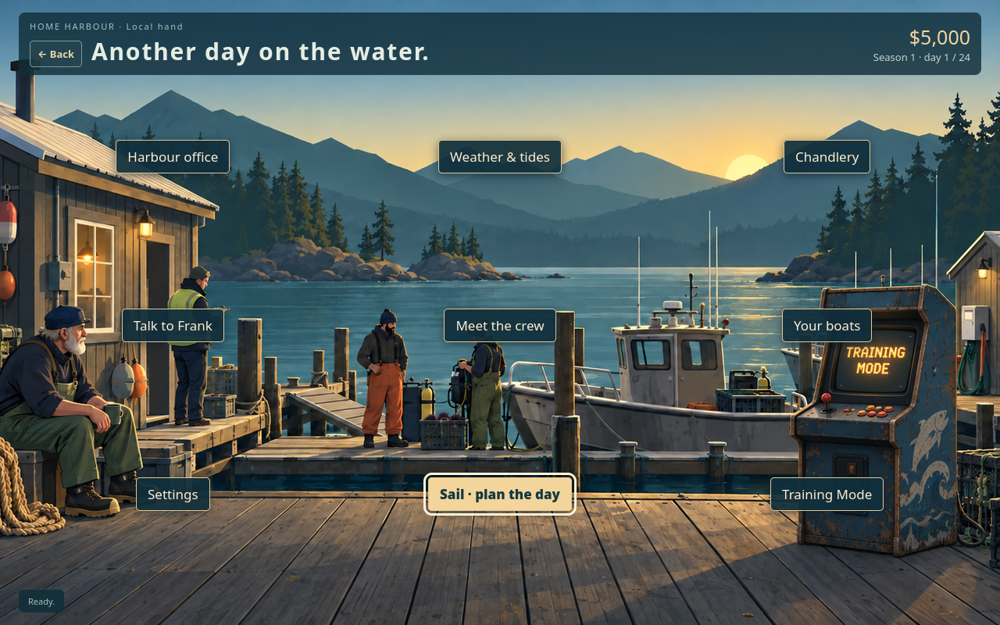
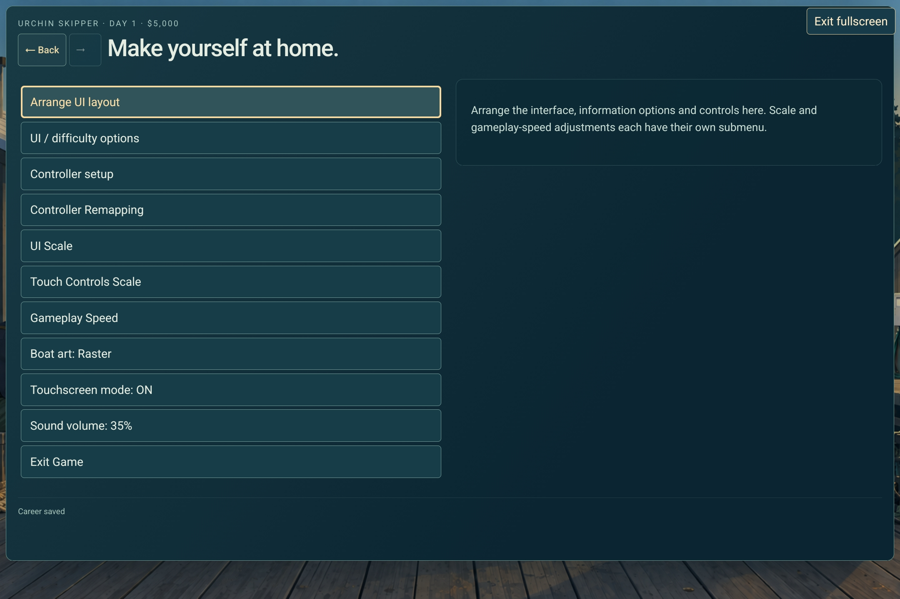
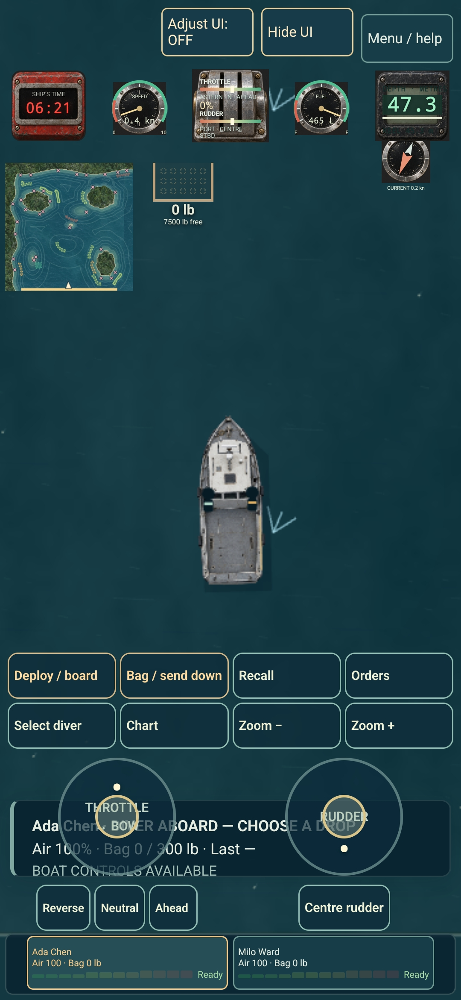

# Urchin Skipper — living design Bible

Updated 2026-09-23. The approved full-game vision, consolidated from the definitive v2 DOCX and subsequent designer decisions. This describes intended design; it does not certify that every system is implemented or fully balanced.

## 1. Purpose and authority

This file is the single current design authority. The designer authorized replacing the DOCX with this living Bible and permanently fixing the game around **exactly two working diver berths per boat**. Explicit subsequent designer instructions take precedence and must be incorporated into the relevant section here.

Update decisions in place. Keep a concise source record in [design provenance](docs/DESIGN_CONSOLIDATION.md); do not create a competing chain of normative amendment documents. Proposed features and unresolved choices remain clearly identified outside this Bible until approved. Routine implementation and reversible tuning within this design remain autonomous.

If requested work conflicts with an agreed design rule, report the conflict before changing that behavior. Ask the designer when their preference cannot be established. Do not silently treat current code, passing tests, old feedback, or an assistant's recommendation as design approval.

[PROJECT_STATUS.md](PROJECT_STATUS.md) records the actual build, outstanding work and verification. [PLAYTEST_GUIDE.md](PLAYTEST_GUIDE.md) describes testing; [DEVELOPMENT_NOTES.md](DEVELOPMENT_NOTES.md) and technical documents explain implementation. They do not override this design. Historical documents preserve evidence only.

The [prior DOCX and retrieval mirror](archive/design/2026-09-23/README.md) are archived intact. The approved visual references are collected in [§23](#23-approved-visual-references). Preserve originals, careers, artwork and older exports. [AGENTS.md](AGENTS.md) owns the working and GitHub/TEMP backup policy; routine checkpoints remain retired.

The September 23 working-day implementation request approved handling, deck/pickup, buyer, chart-memory, surface-banter, rival and equipment-switch changes now incorporated below. [Implementation and verification](docs/WORKING_DAY_2026-09-23.md); [longer crew-writing proposal](docs/CREW_RELATIONSHIPS_PROPOSAL.txt) remains a proposal beyond its explicitly implemented first pass.

## 2. Core vision and intended experience

The player is the skipper of a small commercial sea-urchin dive boat. They control the boat and give high-level instructions to two autonomous solo SCUBA divers. There is no manual underwater control or planned tender/hookah replacement.

The working-day loop is: prepare at harbour; inspect forecast, tides and current; choose boat, crew, equipment and ground; travel; search using charts, sounder and learned knowledge; deploy divers; read bubbles and floats; maneuver and recover; accumulate catch; decide whether to continue, move or return; offload and sell; pay costs and crew; compare results; repair, hire, upgrade and plan the next day.

The feel is a chaotic but believable working-boat operation. Becoming better means learning grounds and conditions, handling different boats, knowing crew, managing risk and judging whether another bag is worthwhile. Ordinary productive work must remain satisfying. Memorable days should emerge from interacting systems without relying on scripted missions, event spam or an abstract arcade score.

Boat progression changes handling, range, load, equipment and weather capability. It never unlocks a one-diver or three-plus-diver boat configuration. Two divers retain independent orders, deployment, recovery and health; this crew-size rule does not require simultaneous underwater work or replace existing injury/absence rules.

## 3. Camera, presentation, art and audio

Use a rigid orthographic bird's-eye/top-down camera following the boat. Zoom ranges from close working detail to a large-area view. There is no normal free-pan strategy camera. Temporary tutorial framing can keep dialogue and the boat visible without changing projection or world geometry.

Prioritize readable boats, floats, bubbles, kelp, reefs, wake, weather and deck load. Environmental effects should communicate current, movement and wind as well as atmosphere. A diver is a simple black figure on deck or beside a surfaced float; underwater the diver's body is invisible and bubbles show location. Wash, bubbles and underwater effects draw below the boat.

Use the supplied Channelmaster image for title/save/load and the supplied named vessel artwork for the fleet. Preserve original assets. The exact supplied starter Workhorse image is the approved exception to strict-overhead boat art; other boats retain the overhead requirement. Provide proper title, launcher and Steam artwork, distinct crew portraits and an installed-equipment boat blueprint. Art and collision geometry remain separate.

Audio communicates engine state, throttle, distinct neutral/forward/reverse and jet behavior, wind, waves, recoveries, impacts, warnings and radio/crew cues. Powered wash responds to input before the hull gains speed. Surfacing has an audible whistle with a limited range. Preserve procedural sounds and keep the mix readable without overwhelming the player.

The title backdrop fills the viewport while its bounded options card scrolls. Preserve the scenic harbour composition and its coordinated buttons as described in §23. Small displays pan the harbour scene. The header sizes to its content and must not cover destinations as UI Scale changes.

## 4. World, coastline, bathymetry and grounding

One deterministic world supplies terrain/depth, reefs, current, grounding, soundings, diver AI and rendered geometry. Real locations are welcome where practical. Coastlines include beaches and gentle shelves, normal and steep slopes, reefs, rocks and occasional deep water immediately beside cliffs. Show a useful shallow-water gradient over roughly 0–10 m.

The sounder measures directly beneath the boat. It does not reveal surrounding hazards. Boat draft/contact depth varies by hull; initial examples are about 2 m for rudder boats and 1 m for jets. Plain shoal grounding severely constrains motion without hull damage. Deeper water astern permits backing off; approximately 0.5 m/s is an initial target. Easy includes reverse grounding assistance. Realistic retains wind-limited escape. This is an explicit exception to otherwise shared simulation rules.

Tides affect clearance and can expose or close access to fishing basins. Tide-locked basins are part of the design. Some natural high tides admit shallow-draft jets but never provide enough clearance for conventional boats. Keep navigable entrances, sheltered working pockets and meaningful route choices.

Fixed hittable shoreline rocks rise toward the surface from surrounding seabed roughly 1–5 m deep. Distinguish seabed depth from clearance over a rock. Charted hazards show top clearance at chart datum, or “dries”; current tide changes actual clearance. Only some hazards are charted. Uncharted crowns and wash remain conspicuous in all difficulty modes within weather/light visibility limits. Safe submerged rocks use blue tones; shallow crowns use warmer tones and broken wash; exposed tops have a dry crown and continuous pale rim.

Rock and timber impacts can damage hull/drive according to contact and speed. Gentle contact and sufficient clearance do not. Rocks stay fixed, allow backing away, and do not repeatedly inflict damage during one continuous contact. Local soundings and scanners detect tops only within their measurement footprints. Other boats route around physical hazards.

Floating logs remain uncharted. Night and fog add large, bounded, persistent cohorts; logs keep drifting after conditions improve. Spawn them clear of the boat/divers and preserve them through reloads. Current ordinary-sector tuning is 72 base logs, +360 at night and +288 in fog, giving 720 with both; occasional events may add timber. Original sectors use 40 fixed features, 30 charted and 10 uncharted; harder coasts vary. These counts are tuning rather than universal map templates.

## 5. Fishing grounds and hidden productivity

Use hidden productive fields/patches rather than simulating individual urchins. Favor flat or gentle slopes, low-current pockets, channels and shoreline-adjacent ground; avoid very strong current and dead zones except near a current die-off. Productive beds must be no deeper than **70 ft, approximately 21 m**. Frank's broader 5–25 m scouting advice does not change that generation limit.

Grounds should follow shoreline and contour in elongated, curved shapes, rather than appearing as scattered circles. Data can include density, quality, depth, terrain, direction and size. The original 1,000–4,000 lb patch range is a tunable starting point. Include obvious good, poor and empty examples for testing.

Preserve existing reef IDs, geography, stock and observations when adding grounds. The established original-sector recipe has 13 marked and 52 unmarked patches; newer sectors may add richer or specialized beds. Unmarked stock is available to player and rival divers. Ordinary water/chart overlays and hit targets do not reveal unmarked live boundaries, even after a diver reports a sample.

Players learn through actual exploration and diver reports. Persist observed depths, reefs, sampled quality, worked-thin reports, chart tracks and personal marks. Preserve the age and limited scope of observations. September 23: show report age and the reporting diver, remember the actual sample position and tide phase, and let the skipper make a personal mark from a recent report. Mark guidance provides bearing/distance to an already known point; it does not reveal unmarked bed boundaries or live stock. Better charting/scanning equipment improves records without providing universal live stock knowledge. Easy/debug may reveal specifically allowed information; Realistic retains hidden productivity. The explicit temporary “Reveal every urchin” developer overlay is not a persistent chart upgrade or a normal information entitlement.

Harvesting removes local patch stock shared by physical rival crews. Longer-term fishery pressure and season recovery are separate from immediate patch exhaustion. Current nine-day rollover tuning uses survivor growth of 1.35 plus 0.4% recolonization, replacing automatic doubling. Regional pressure weights and recovery remain balance data. Do not reset depleted beds through travel, reloads or save migration.

## 6. Boats and boat handling

Commercial working hulls differ in capacity, weather capability, fuel use, windage, draft and maneuverability. Supported propulsion families include prop/rudder, outboard, leg and jet, single/twin engines and bow thrusters. Preserve the established controller feel and improve it conservatively.

Boats have momentum. Use velocity through water—world velocity minus local current—with stronger lateral than longitudinal resistance. Wind acts according to hull/cabin exposure. Rudder boats turn through propwash and water flowing over the rudder, including in neutral; powered authority remains reduced at top speed and in reverse. High-speed turns are broad. Twin engines improve maneuverability; steerable drives handle well; jets maneuver well in reverse and can pivot. Bow thrust provides a distinct fitted capability.

September 23 working-day decision: in neutral, a perfectly aligned boat drifts astern in current; deflecting a shaft rudder supplies passive yaw. Outboard/leg appendages have substantially less passive area; unpowered jet nozzles supply none. Off-axis hull pressure tends toward a beam-on drift, resisted more by shaft appendages than legs and least by jets. Use water-relative forces alongside independent wind loads. Larger hulls have more environmental exposure and retain more stopping/turning momentum; cargo adds inertia. Do not invent perpetual rudder force once a boat is moving with uniform water.

Keep mass, acceleration, speed, reverse, steering, rudder authority, thruster force, draft, waves, windage and fuel configurable. Prefer forces/corrections to blindly overwriting velocity. Physics references remain conceptual aids rather than a mandate to copy another architecture.

Every existing career hull accepts the bow-thruster retrofit; factory thrusters remain usable. Twin-jet neutral pivot and bow thrust are independent. Sister hulls remain paired with originals in shops and independently vary capacity, fuel tank, speed, contact depth, price, handling, durability and passage fuel use. Hidden handling/durability differences affect actual behavior. Island Tender's approved load-speed targets are 25 knots empty, 20 half-loaded and 15 full.

Shops start without a selected boat. Selecting a boat/equipment card previews details without spending money. Separate explicit Buy controls open a confirmation naming the item and price, initially on Cancel. Keep the selected candidate stable during rendering/focus movement. Keep owned hulls available for comparison; disable already-owned/fitted purchases. “Your boat” opens the current setup, fuel, condition, installed gear and owned-boat controls. Narrow views place details below the selected pair/row; larger views place them alongside. Purchase controls remain reachable.

Current balance examples: both starter boats cost $15,000; bow-thruster retrofit $20,000; diver flashlights $450 for both divers on the fitted boat. These are reversible tuning values, not reasons to add new hull/crew configurations.

## 7. Wind, current, waves and weather

Wind, current and waves are independent variables and may have different directions. Surface current moves both the boat and surfaced diver/float. Waves affect pitch/roll, handling and visibility; rough water reduces bubble readability. Use believable inexpensive approximations, not fluid dynamics.

Strong channels can reach roughly 3–5 knots. The legacy feel example is a nominal 10-knot boat traveling about 14 with, or 6 against, a 5-knot flow; these are approximate tuning targets. A diver can initially hold around 2 knots of current; around 3 knots might produce approximately 1 knot of net drift. Stronger current may sweep a diver off productive ground before the bag fills. Existing search, surfacing and air logic then determines the outcome.

Communicate current through kelp, drift, fixed objects and, where enabled, current arrows. Boat and diver use the same local current. New coasts may have stronger channels, shifting wind, swell and eddies while retaining shelter; rain need not increase with wind.

Weather includes calm, rain, squalls, storms, fog, wind shifts, rough seas, lightning and rare rogue waves. Conditions affect decisions and handling. Forecasts provide current detail and seven seeded daily outlooks with increasing uncertainty; equipment/experience can improve confidence without perfect foreknowledge. Viewing a forecast never advances or mutates the world.

Night is 19:30–06:00. Without diver flashlights, deployed divers begin their normal warned ascent and cannot descend again in darkness. Boat working lights are separate: they illuminate port recovery and forward water. Installed operational upgrades have saved per-boat switches reachable at harbour and at sea. Enabled boat lights operate automatically only after dark, with softly feathered forward and port recovery pools. Disabled lights also remove their night visibility/pickup benefit. Change diver equipment with both people aboard, finish a lift before switching its hauler, and use auxiliary fuel before isolating its tank.

Distant bubbles fade in waves/rain and disappear beyond fog visibility. Night work doubles fatigue accrual.

## 8. Divers: core rules, AI and instructions

Every player boat has exactly two working diver berths. Do not plan one-diver boats or additional diver slots. Divers are autonomous solo SCUBA agents, selected and instructed through presets rather than free text.

Orders can include compass direction, minimum quality, maximum scouting time and maximum bag time. Quality presets are Any / 60% / 70% / 80% / 90%. Orders belong to the person and survive trips, days, berth changes and reloads. Normal scout allowance starts around 70 seconds; experienced crew can default to 15 seconds. Remember player changes per diver.

Separate searching from harvesting. Initial awareness is approximately 30 ft / 9 m. Direction biases movement but does not override worthwhile nearby ground: a patch about 25 ft behind the instruction can be noticed, while one 50 ft behind should be missed. Open-water scouting alternates ±45° legs around the instruction about every seven simulation seconds, follows coastal contours where useful, and corrects toward deeper water near 5 m and shallower water near 20 m. Detected worthwhile ground permits direct approach. Avoid adding A* without a demonstrated obstacle/pathfinding need.

The bag clock begins on reaching worthwhile ground. Part-filled bags slow swimming/search according to tunable weight. When the entire working patch is exhausted, surface immediately with a full, partial or empty bag; do not silently move to a different patch. After ordinary bag turnaround, a fresh bag permits another descent if productive ground and dive allowance remain.

Crew improve swimming, picking, current holding, awareness, tank/air endurance and fatigue resistance. Experience can also improve boarding/bag-work performance without adding another roster specialty. Their behaviors and responses should make differences understandable. Injury and exposure rules are in §§9, 14 and 15.

## 9. Bag timing, air, exposure and surface behavior

Time is accelerated. The original illustrative bag calibration used roughly 30 simulation seconds for a good 15-minute fictional bag, with exceptional/good/acceptable/poor examples around 20/30/40/60 simulation seconds. These illustrate pacing rather than requiring a reset of current career tuning, which uses a 45-second base before crew/ground modifiers. Current picking labels are Very fast / Fast / Slow / Very slow. Fishing time stops when the diver surfaces and remains separate from recovery time. Keep timing configurable.

A full bag is approximately 300 lb. Smaller bags arise from legitimate interruptions such as air reserve, exhausted ground or current displacement; 150 lb is a valid partial bag rather than the default full bag.

Air is a simple forced-surface budget. Initial air is 100 units; reaching 20 forces harmless ascent regardless of bag state. Low air by itself never causes injury, death or an emergency state. Tank improvements and career air-use tuning affect endurance without removing the reserve. Scout limits prevent spending the entire tank searching.

Dive exposure is a **fictional game abstraction**, not US Navy tables or a real dive-planning tool. Shallow water allows much longer work; deep water requires surface breaks. Track short exposure, slower repeated-day strain and individual adherence. All time above water—including deck preparation, bag exchange, travel and harbour waits—contributes to recovery. Fresh tanks/bags, boarding, hires and reloads do not erase exposure. Consecutive heavy days raise risk; rest reduces it.

Normal descent waits until predicted allowance covers a full bag at the intended depth. Resurfaced divers use their last observed depth/rate/bag duration plus search/ascent allowance; moving and redeploying uses local depth. Conservative divers stop earlier; hidden reckless individuals may ignore limits. Show a nitrogen/readiness meter where diver information is enabled, without exposing exact hidden hazard probabilities or personality flags. Portrait-only selection remains identity-only.

Current fictional allowance tuning is 1,200 / 300 / 165 / 110 / 80 / 60 game minutes in depth bands ≤6.5 / 12 / 18 / 22 / 30 / deeper metres, with an 18-game-minute short-load half-life. Nitrox is a rank-two upgrade, presently $85,000, adding 60% allowance and 20% air endurance; entry from deck adds one second, while ordinary surfaced bag exchange does not. These values are tunable and unsuitable for real diving.

Underwater location is bubbles; ascent increases bubble density before the orange float appears, with about five seconds of warning. A surfaced diver stays with the float. Fit surfaced divers stranded over shoals may swim slowly toward nearby water with room for the boat's full footprint; routes stay wet, and valid or ongoing pickup stops the movement. Do not teleport them.

## 10. Recovery and deck work

Recovery rewards boat handling: bring the working side alongside at low relative speed. Use roughly a 120° port-side sector, rather than an all-round interaction circle. Initial distance targets are approximately 5 m in Easy and 3 m in Realistic; a low-speed reference is under 1.5 knots relative to the diver. Assistance may clarify valid actions or widen allowed tolerances.

Bag turnaround and ending a diver's operation are distinct. Bag-only recovery can keep a productive diver working; boarding with any outstanding bag permits moving or ending that operation. Maintain a short bag hook/preparation phase around three seconds. Boarding adds two seconds, with or without a bag. Returning aboard resets deployment state for a fresh bag without erasing persistent fatigue/exposure.

Show the currently valid action and readable reasons when an operation is unavailable. Physical deck bags and recovery sound communicate completion. September 23: surfaced floats may show a subtle distance/readiness cue in both difficulties while physically visible; green means the actual recovery gates pass and amber gives one actionable reason. Keep underwater and fog/night information restrictions. Surface speech bubbles convey a sampled-bag opinion, with occasional brief authored crew text and per-person cooldowns. Frank teaches port relative to bow, Neutral, matching drift, the actual working rail and the danger of reversing the stern into a diver.

## 11. Deck, loading and catch handling

Recovered bags visibly accumulate on the working deck and affect exact boat load. Keep visual bag placement separate from numerical weight and capacity. September 23: bags are conspicuously red, large and fixed in size. Use bounded overlapping layers inside the working deck; existing bags do not shrink or rearrange as more arrive, and later layers cover deck gaps. Loading affects hull behavior and load-sensitive travel speed.

Exact deck/diver readouts are permitted in Realistic by the subsequent information amendment; they can be independently hidden. Physical bags remain useful information when readouts are off. Preserve modular UI and the remaining hidden-ground/underwater-information limits in §18.

September 23 market decision supersedes the former blanket prohibition on catch sorting: show the sampled quality of each recovered bag and let the skipper choose a deck bag to dump overboard. Dumping takes that bag’s original hauling time, reserves the deck while the boat and sea continue moving, survives reload and removes its weight and sale value exactly once. It does not restore harvested stock. No additional catch-care minigame is approved. Freshness, bag quality and hidden undersize outcomes feed established settlement. Undersize occurrence is diver-specific per bag; ordinary default tuning is a 1% chance of one undersized urchin. DFO independently detects each occurrence at 25% and charges $1,000 per detected urchin to the boat at settlement, without deducting it from crew shares. Preserve outcomes through reloads and charge once.

## 12. Day, travel, chart and offload

Harbour menus pause time. The default browser world-speed increase is +50% (1.5× original pace), with deliberate saved preferences retained. Ordinary planning begins at 05:00, with a later rested departure and Sleep/rest options. Choose destination and drop location using travel time, conditions, boat and crew. Passage is abstracted; distance and actual boat speed/fuel use reduce working time. Example return allowances are three hours for a distant ground or one hour for a near ground, with tunable weather-sensitive travel.

The evening offload deadline is 19:00. Late/night work remains possible with equipment, fatigue, freshness and offload consequences. Missing evening offload means offloading at 06:00 next morning, with earliest ensuing departure at 09:00. Preserve meaningful rest and recovery rather than the old random shipping-delay behavior.

To leave, drive through the appropriate map edge with both divers aboard. A short boat/crew/deck fade continues the actual approach heading and explains onward travel. The animation neither creates extra fishing time nor repeats passage fuel, inspection or settlement after reload.

Charts are partial surveys. Record permitted known grounds, dated diver observations, charted rocks, explored depths, equipment tracks and player marks. The current-sector minimap uses the same knowledge and a live boat triangle. It excludes moving logs, uncharted rocks, unknown ground and underwater divers. Tapping Chart opens a persistent larger chart. “Chart only” has no surrounding information card/text. Large chart windows retain sensible map proportions and square hit targets instead of stretching around a tiny map.

New Career is offered only at Title. Logbook provides Save game now and Load saved day/career. Preserve immutable snapshots when a planning day is first reached and additive manual restore points; archive current progress before loading. Never automatically prune unique old snapshots. Stop adding snapshots and prompt export before consuming the live-save reserve. Browser-local careers can be transferred through explicit export/import, not assumed shared across devices/origins.

## 13. Career, economy and progression

Career progress comes from money, assets, reputation/experience, crew access and knowledge. Revenue reflects landed catch, quality, freshness and markets. September 23: before sailing, offer optional daily buyer orders with distinct quality and volume demands. Small local contacts are available initially; premium and bulk contacts unlock through sales and safe returns. Premium demand includes 3,000 landed lb at 90%+; bulk demand includes 10,000 lb at 60%+. Pay a bonus per qualifying landed pound up to the selected order’s cap, including partial orders. Extra or lower-quality catch sells normally, with no shortfall fine or duty to fill the boat. Shipping age still matters, current trips keep saved agreements, and orders cannot be changed at sea. Show return-now progress/bonus estimates and the actual settlement on the receipt. Meaningful costs include fuel, shares/wages, maintenance, repairs, boats, equipment, licences, insurance and financing. Avoid accounting that creates no decision.

Start with $20,000 and a choice of two $15,000 starter boats, leaving $5,000 working cash. Buying equipment/boats, refuelling, repairing, renewing licences and repaying debt use explicit confirmations initially on Cancel. Selecting owned boats or share-paid crew is not itself a purchase. Insurance is automatic at departure, retaining costs and coverage without an arming/reminder interaction or separate premium confirmation.

Seasons last nine days. Coasts contain three separate physical maps, with area opening days 1/3/5 within each coast and permanent coast permits. Preserve every existing map, current field, stock and chart history.

| Coast | Permanent permit, current tuning | Destinations |
| --- | --- | --- |
| Home Coast | Included | Sheltered Kelp, South Reef, Outer Ledge |
| Stormbreak Coast | $12,000 | Stormbreak Channel, Gale Sound, Broken Cape |
| Frontier Coast | $30,000 | Blackwater Reach, Wreck Teeth, Last Light Bank |
| Maelstrom | $60,000 | Three additional physical sectors |
| Outer Reaches | $100,000 | Three additional physical sectors |

Sail displays unavailable destinations with opening day and/or permit requirement. Accounts sells each coast's permanent permit once; cancellation/repeat purchase cannot charge. Preserve legacy paid access without charging/refunding or replenishing grounds during migration. Increased stock, quality, price, current, hazards and travel create tradeoffs on more exposed coasts; every map retains workable shelter.

Better crew contacts require a combined operating record, rather than a permit or a single rank number: crew returns, total catch, best load/net day, sales, safe days, substantial working days and controlled fatigue. Current rank-one targets include 5,000 lb total, 1,400 lb best load, $2,500 best net, $8,000 sales, three safe days and a six-hour day at ≤72% fatigue. Rank two uses 15,000 lb, 2,800 lb, $6,500, $30,000, six safe days and an eight-hour day at ≤62%. These remain balance targets rather than promises about when a player will unlock contacts.

Economic failure is the principal long-term fail state. A bad day need not trigger arbitrary Game Over, but catastrophic losses can make continuing impossible. Retain existing ways to recover through work, rest, hiring or financing without guaranteeing rescue from every decision. Track useful records such as best load/revenue/net return, average catch, boat history, work days and incidents. Lead the offload receipt with net return and up to three factual highlights drawn from the actual bags, buyer bonus, missed offload or previous trip. Do not fabricate causes or treat gross sales as profit. Long-season economic balance remains a playtesting question, not established by this document.

## 14. Crew, hiring, shares and fatigue

Hireable divers are distinct people with ability, expected shares/wages, reliability, experience and traits. Their search judgement, picking, air use, swimming, current tolerance, awareness, fatigue and recovery should show in understandable behavior. Portraits, stat comparisons, concise bios and crew/radio dialogue support attachment without becoming a soap-opera simulator.

Maintain two assigned berths and a wider hireable roster. The approved visible roster has 32 divers: picking, awareness, fatigue and tank are each major specialties five times; air, current and swimming four times. Each person has one full-growth major and two distinct minors at 30% growth. Ada retains picking major with air/tank minors. Hidden mystery crew sit outside this allocation. Preserve readable legacy surplus profiles and already-hired legacy people.

Progression reaches level 20 and allows strong specialists. Keep bounded air/fatigue savings, presently 65%. Existing identity, experience, employer, orders and history survive moves and migrations. Hireable access rewards an operating record. Loyal crews stay loyal; others can be poached or leave under established conditions. Injury, other work, conflict, sickness or personal events can affect availability.

Fatigue accumulates over work and successive days. Swimming, picking, air use and current holding begin to suffer at a modest level, currently 8%. Work accrual is presently 0.00065 per simulation second before modifiers; overnight recovery is 6.5 percentage points, full rest adds 22, night doubles accrual, and returns after 19:00 add 2.5 points per late hour. Work duration and skills affect accumulation. These values are tuning; preserve the distinction between fatigue, air and nitrogen exposure.

Use a clear share/wage model reflecting commercial work. Routine percentages may be tuned autonomously; current tuning pays each diver 40% of the landed value attributed to their own catch, before boat operating costs. Legacy unattributed value is divided equally among the working crew before applying that rate. Availability and medical history should have readable causes. Never invent a retrospective diagnosis for an old unexplained absence.

## 15. Injury, safety and consequences

The game includes diver injury, fatalities and serious operational consequences. Safety creates legible decisions without gore or arbitrary punishment. Risks arise from bad recoveries, collisions, exhaustion, exposure, weather, equipment and judgement. Catastrophic outcomes should be rare and connected to meaningful risk.

Slow surface contact can be harmless. Current general-contact injury/fatal thresholds are 2.8/4.8 m/s; powered exposed stern contact remains more dangerous at 1.8/2.2 m/s. Use actual swept hull, relative motion and contact geometry. Underwater bubble markers are never collision targets. These are fictional gameplay values.

Suspected decompression illness is assessed through the fictional exposure model at surfacing. It ends ordinary fishing while allowing recovery and medical return/rescue; injury reduces availability, currently five game days for DCS. This is not medical advice. Preserve existing collision emergencies, rescue paths and historical consequences. Safe low-air ascent remains entirely separate.

Boat impacts can produce repair costs through catastrophic loss according to severity and circumstances; harmless bottom grounding remains separate. Insurance covers established once-per-trip outcomes. Current premiums begin at $65/trip, plus $25 per recorded diver injury and $75 per fatality. A recovering diver does not generate repeated new claims. Prior incidents affect later quotes; coverage already paid for the trip remains fixed.

End-of-day reporting identifies incident, cause, time, injury/fatality, expected availability and insurance effect. A clean day reports no injury/direct safety charge. Preserve the possibility of economic failure and the existing recovery options.

## 16. Other boats, rivals and inspections

Other skippers have recognizable boats, grounds, tendencies and performance. Use the supplied rival assets with seeded speed/maneuverability and distinct crews. September 23: a few persistent teams are recognizably selfish, sometimes selecting a bed already worked by the player. Show their boat names on genuine nearby sightings and concise radio introductions. Their actual picking depletes shared stock; encounters are noticeable without making every rival crowd the player. Rival activity consumes grounds and daily landings provide context. Physical local rivals use shared stock and visible bubbles, pickup movement and deck bags; off-map work is bounded aggregate activity and must not double-count the active map.

Rivals choose grounds according to weather, experience and achievable passage times. Slow boats do not attempt impossible remote round trips. Current increased activity selects roughly 78% of ordinary teams daily with higher catch targets/pressure. Keep participation, rates and routes tunable. Preserve the distinction between immediate patch depletion and seasonal fishery pressure.

The mystery vessel's canonical name is **Shy Hull Wood**. Its loyal hidden divers are Paul and Worm, and its skipper is Jessy Bean. Keep them out of normal crew/boat information and poaching. Preserve its rare radio material in §17.

Taxis travel around 30 knots, avoid boats but ignore underwater bubbles, and can strike a surfaced diver under the ordinary injury rules. Routes should cross productive ground, with a noticeable share crossing currently worked beds; commit each course rather than homing on moving divers. Warn on an actual close fast pass near a surfaced diver. The player can position to influence traffic. Nine-ships tourists move around 5 knots and avoid bubbles. Keep spawns, routes and encounters configurable.

DFO uses a roughly 25-knot patrol boat, waits about 100 m clear, and boards after invitation, recovered divers and a slowed boat. Provide direct readable skipper interaction. A bounded alongside-positioning transition may bypass shoal depth as the approved patrol exception; it does not change player grounding. Deployment remains blocked during inspection and the short casting-off transition. Fine settlement occurs once across saving, reloading and sector changes.

The ordinary career inspection schedule is first visit on day 3, none on days 4–8, then one seeded day in each eight-day block beginning 9–16, 17–24 and onward. Arrival is 11:00–14:00. Missing that fishing window creates no backlog; season boundaries do not reset the schedule. Default aboard inspection is six game minutes. Wildlife incidents can separately increase patrol scheduling. Undersize fines follow §11; inspections are no longer time-only.

## 17. Events, wildlife and rare weirdness

Storms, fog, waves, debris, equipment problems, wildlife, traffic, inspections and crew events intersect with the current plan. Preserve existing event frequency in this pass, as explicitly requested September 23; polish readability and context rather than reducing encounters.

Radio history contains broadcasts and patrol calls, including when reading older logs. Local diver, bag and helm feedback stays separate.

Surfaced whale strikes incur species-dependent fines and increased patrol likelihood; submerged whales cannot be hit. Current fines are $35,000 for orca and $50,000 for humpback, once per animal, with increased patrol scheduling through day +6. Rock sea lions intermittently interfere with picking without injury; current harassment is within 45 m and reduces picking to 55%. Use restrained wildlife/bird scheduling, including geese.

References to maritime games, diving culture, science fiction and project history remain restrained and original. Do not reproduce copyrighted characters/assets directly. Shy Hull Wood may reverently report “urchin sign the likes of which God has never seen.” Rare unexplained sonar returns, distant lights, radio calls, abandoned objects or fleeting impossible readings need not all be explained. Easter eggs remain seasoning rather than the game's organizing principle.

## 18. Difficulty, information, menus and layout

Easy, Realistic, All Off and a restorable Custom configuration are explicit. Difficulty limits hidden assistance; ordinary UI preferences remain configurable in both career difficulties. Easy can provide underwater positions/states, target highlighting and delayed off-screen directional help. Realistic uses identity-only portrait selection in place of hidden underwater indicators, and excludes omniscient ground/current assistance. Exact deck/diver readouts, clock/offload, helm instruments and permitted chart markings remain allowed by the explicit later amendment. Do not revive the original blanket ban on exact Realistic weight.

Simulation is shared wherever practical. Approved handling/recovery assists, especially Easy reverse grounding, are explicit exceptions. Toggling information does not itself remove weather, rivals or other simulation systems. Realistic retains darker submerged visibility, with an approximate original target of hazardous reefs becoming barely readable within 100 ft; conspicuous uncharted crowns/wash are the explicit shoreline-hazard exception. The physical scene still communicates bubbles/floats and current.

Boat and two diver cards are separate. Provide independently selectable current, weather/electronics, chart/minimap, sounder, clock, loading/condition and controls/message windows. Disabling the boat card must not disable independent instruments. Graphic instruments default on, with plain-text alternatives where appropriate. Clock/offload text and sounder text are independent switches; both/either/neither are possible. Purchased timepieces are cosmetic, with original digital clock still selectable.

Compact diver cards show nitrogen meter/readiness without the exact percentage or forecast reference depth; detailed views can show fuller information. Minimap and independent sounder default on in Easy/Realistic and off in All Off. Controls help defaults on for tutorials and off for real careers, while respecting deliberate user overrides.

Save positions and sizes per browser, input mode and orientation. Saved user layouts take priority over adaptive defaults. Arrange UI includes hidden/conditional windows; select a card and use move/resize arrows or buttons. Cards are not dragged in this editor. Save applies the draft, Back discards it; resets are explicit. Only touch mode with Adjust UI enabled shows live move/resize/close handles. Adjust UI starts off. A non-control card/minimap tap can toggle 25% opacity. Hide/Show information masks/restores the chosen windows without altering their settings.

Support both landscape and portrait. UI Scale is independent, 50–150%. “Tiny Touch Controls” adjusts controls only: its shortcut selects 70%; the full range is 50–150% in five-point increments. Below 100% is Tiny, and disabling it restores 100%. The old Tiny UI multiplier, separate Tiny layouts and experimental Fit mode are retired; preserve old stored preferences for compatibility with older exports.

Touchscreen Options is reachable from Title, Settings and Pause, including Frank's lesson. It groups touch mode, control scale/Tiny, control opacity, preview/reset, Adjust UI and Show information. Control opacity ranges 0–100%, with five-point controller adjustments. Menu/help remains visible even at zero control opacity; information windows remain independently controlled. Opening title options does not advance/replace the career. Portrait defaults follow §23 while preserving saved layouts.

Touch mode, control scale and opacity are browser-local preferences, preserved through reloads and career/training changes independently of simulation state.

Back/Forward follows visited menus and restores selection, view and scroll state. Never replay a purchase, order draft or exit confirmation. Opening a new branch, resuming or replacing the world clears obsolete forward history. Sea Pause Back returns to water; sea Settings Back resumes water, while its children first return to Settings. Harbour Settings returns to Harbour. Direct at-sea charts/orders return to water. Only the harbour/root briefing/starter route reaches Title through ordinary Back; explicit Title/Exit actions retain their meaning. Escape closes menus to the current water/harbour location without sailing or advancing a day, and first cancels pending input capture.

## 19. Controls and browser access

Keyboard, gamepad and touch resolve to the same abstract commands. Preserve custom bindings, verified USB Xbox behavior and device-specific profiles. Never infer a raw Deck layout from an illustration or change global Steam/desktop shortcuts. Provide device diagrams, visible bindings, per-device remapping/reset and physical capture. Selecting a diagram does not change hardware mapping.

| Controller default | Action |
| --- | --- |
| Left stick up/down | Persistent throttle |
| Left stick left/right | Hold fitted bow thrust; mutually exclusive with throttle adjustment |
| Right stick left/right | Persistent rudder |
| Right stick up/down | Neutral twin-jet pivot: up port, down starboard; menu detail scrolling |
| D-pad up/down; left/right | Full ahead/reverse; neutral |
| Y | Deploy from deck or recover diver and outstanding bag |
| X | Recover bag or provide fresh bag/redescent |
| A at sea | Recall nearby underwater diver within 5 m of bubbles; clang and 2–5 second response |
| LB / B | Next diver / orders |
| RB | Cycle information presets within career difficulty: Easy → Realistic → All Off, or Realistic ↔ All Off |
| R3 / L3 | Difficulty/assists / chart tools |
| LT / RT | Zoom; contextual forecast/search-limit adjustment |
| Menu; A/B in menus | Pause/close; Select/Back |
| View | Input diagnostics |

| Keyboard default | Action |
| --- | --- |
| W/S; A/D | Throttle; rudder |
| X or Space; Enter | Neutral throttle; centre rudder at sea / Select in menus |
| Q/E or Up/Down | Neutral twin-jet pivot |
| Caps Lock or Left; F or Right | Hold bow thruster port/starboard |
| 1 / 2 / 3 | Deploy/board; bag work; nearby recall |
| Tab; B or O | Next diver; orders |
| +/− including keypad | Zoom |
| Shift alone | Cycle information presets |
| Page Up / Page Down | Full ahead / full reverse |
| M / T | Chart / tides |
| Escape; Backspace/B in menus | Pause/close to location; Back/cancel |
| Arrow keys in menus | Navigation / compass orders |
| F2 / F3 / F4 / F6 | Remapping / detail levels / diagnostics / assists |

Shift activates alone on release; modified shortcuts do not also command the boat. Caps Lock uses physical held state, not text case. Form typing/navigation remains usable. Handle delivered game keys and browser defaults locally while respecting reserved browser/OS shortcuts and Alt/Ctrl/Meta combinations. Existing bindings take precedence over newly added defaults; resets affect only the chosen device.

Touch offers independent throttle/bow and rudder controls plus all diver, gear, chart, order and zoom actions. Release holds commanded throttle/rudder and shows their state. Dragging the boat can adjust helm relative to its heading at gesture start; tapping it neutralizes throttle/rudder. Pointer loss, blur, menus and rotation clear held contacts. Touch scrolling stays available in menus.

Fullscreen is available at Title, Settings and Pause, independent of touch mode, through browser-owned APIs. Support embedded hosting and a readable fallback when blocked. Permit rotation and retry orientation unlock across focus/visibility/viewport/fullscreen/touch changes; do not force portrait/landscape. Browser/OS restrictions remain external constraints. Game speed is a browser-local +0–100% preference, default +25%, scaling the complete simulation consistently; training's multiplier is separate.

The detailed [current-build controls guide](docs/CONTROL_DESIGN.md) also records internal developer shortcuts. Those fixtures do not define the normal player-facing menu.

## 20. Technical architecture and delivery

Use a modular Phaser 4 project, currently targeting Phaser 4.2.1, with Matter.js where appropriate. Keep modules focused without a giant monolith or unnecessary framework. Separate bootstrap/scene/camera, input, boat/environment/diver simulation, grounds, catch/loading, recovery, charts/sounder, day/session, UI/assists, audio and configuration.

One authoritative world supplies simulation and presentation. Keep content/tuning separate from logic and decorative geometry separate from collision. UI never drives simulation truth. Standard game objects, canvas/basic textures and simple particles are acceptable; elaborate GLSL or premium rendering dependencies are not required.

Consult existing Phaser/Matter capabilities and official guidance before inventing framework workarounds. Keep dependencies few and preserve required licence notices. Prefer compatible permissive code; do not copy unlicensed work or introduce restrictive obligations without agreement. Existing boat-physics references guide directional drag and believable forces without dictating copied code.

Prepare required artwork and terrain before play and keep terrain locally available. Avoid deferred essential downloads during gameplay. Use bounded caches/work, graceful loading/error feedback and efficient local save handling while preserving simulation behavior and recovery data. Optional troubleshooting is local, off by default and contains bounded diagnostics rather than uploaded private saves. Device emulation cannot establish physical performance or controller behavior.

Deliver playable browser builds with relative local assets and compatible embedded hosting. Local/LAN hosting exposes the build, not the authoring workspace. Keep credentials, careers, profiles, recordings and generated packages out of the public source backup. [AGENTS.md](AGENTS.md#github-backup-and-temp-exports) defines verified source pushes and additive TEMP itch.io/local-Wi-Fi exports; preserve prior releases.

## 21. Frank, training and developer tools

New careers offer day-zero “A talking to by Frank,” introducing the investor, $20,000 budget, boats, crew, gear, difficulty and return costs. An isolated authored cove uses a loan Workhorse, calm water, marked and unmarked ground and ten short action-driven lessons. Actual throttle, turns, zoom, chart opening, search, harvesting and recovery advance relevant steps. Individual lessons and the entire tutorial can be skipped. Save progress; existing careers do not unexpectedly acquire day zero.

Teach port-side recovery, relative drift, stern danger, local soundings, chart limitations and layout controls. Cove scouting guidance is 5–11 m, with a one-minute active-play eastward hint in the unmarked-ground lesson. Subsequent chartplotter/habitat advice distinguishes search guidance from the 70-foot productive-bed limit. The cove has finite islands and open boundary water, including a southern passage; the taught return remains gated by lesson progress and aboard checks.

Completion/skip returns to day-one first-boat selection with full initial funds and fresh crew. Practice costs, catch and exposure never enter career accounts.

Player-facing Training Mode, reached from the dock arcade, Title and Settings, repeats Frank's cove using a copy of the active boat. It first offers handling, fitted bow-thruster/twin-jet, equipment and applicable night lessons. Save the real career before entry and restore it on exit/reload; practice money, health, stock and charts cannot overwrite it. The player-facing arcade is training, replacing the former developer-cheat entrance.

Internal developer fixtures remain available for validation outside the normal title flow. They may reposition the two divers, set states, air, bags, exposure, ground, environment, time, money, boats, gear, levels and hidden reveal; provide pause/step/reset where practical. Keep mutations isolated from real careers. Debug visibility does not automatically define Easy-mode information or permit larger player crews.

## 22. Development and design discipline

Preserve agreed gameplay and working systems. Build in playable, testable increments and favor a sensible dependency order. Integrate and verify each increment; continue independent useful work when one subsystem is blocked. Reuse the established architecture and avoid gratuitous rewrites.

Favor fun, legibility, believable commercial-boat behavior and meaningful decisions over maximum simulation detail. The ocean should produce natural difficulty. Upgrades should change perception or capability rather than exist only as invisible modifiers. Keep values configurable and test interconnected consequences across economy, crew, weather, rivals, equipment, safety and information.

Make routine implementation, asset, tuning and reversible prototype decisions autonomously within this design. Record consequential assumptions briefly. Explicit designer changes belong in this file; bug reports, implementation evidence, failure notes and unapproved ideas belong elsewhere. Historical specifications cannot silently revive removed scope. Current recommendations for a dedicated fun pass remain proposals until commissioned.

Follow the testing, preservation and backup policy in [AGENTS.md](AGENTS.md). Distinguish automated software coverage from real-device checks and observed playtesting. Report completed work, relevant tests, limitations and next useful work concisely. This Bible is the intended design, not proof of full compliance or finished balance.

## 23. Approved visual references

Reference images are preserved without resampling in [docs/reference/bible](docs/reference/bible/README.md), with source hashes in the [preservation receipt](archive/design/2026-09-23/preservation.json). Images guide composition and function; explicit later instructions and saved user layouts take precedence where applicable.

### Harbour

Preserve this scenic composition, artwork, inset heading and coordinated three-by-three button arrangement. The explicitly requested relocations are **Settings top right, Talk to Frank bottom left, Chandlery centre left**. Those placements supersede the labels' earlier positions within the image. Keep Training Mode beside the arcade and retain current shop/navigation behavior. Compact screens pan the composition; responsive header/label fixes must retain usable targets.

### Settings

The designer reconfirmed this screenshot on September 23 as **“an approved reference within reason.”** Preserve its overall organization and readable navigation while allowing responsive sizing and the later Touchscreen Options grouping, control scale/opacity, fullscreen and independent UI Scale decisions. It does not restore retired Fit/Tiny UI behavior or freeze obsolete individual rows. The weather screen is not an approved frozen reference.

### Phone portrait defaults

Use the September 23 phone arrangement as the default-layout guide: instruments across the top, chart/load/current below, clear central boat view, action buttons above the two sticks and separate diver cards below. Maintain readable prompts clear of helm controls. Saved user layouts and accessibility adjustments take precedence; overlaps visible in this reference are not requirements.

